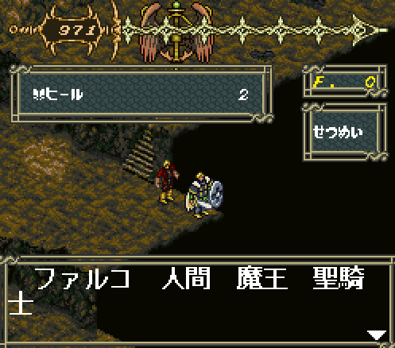

# Dark Half (SNES) 한글화 프로젝트

1996년 세타(Seta)가 슈퍼패미컴으로 발매한 RPG **Dark Half**의 한국어 번역 패치.
일본 국내판만 존재하며 공식 해외 발매가 없었고, 한국어 번역 역시 존재하지 않습니다.

- **대상 롬**: `Dark Half (Japan).sfc` — SNES HiROM, 3MB, MD5 `55108013f875db3b39da04b8f58489ab`
- **작업 폴더**: [`darkhalf-kr/`](darkhalf-kr/)
- **상세 기술 기록**: [`darkhalf-kr/PROGRESS.md`](darkhalf-kr/PROGRESS.md)

---

## 현재 상태


마법 `힐`의 설명문 자리에 **새로 확장한 글리프 영역**의 한글을 띄운 화면입니다.
`한글성공`은 프리픽스 `$5D`(글리프 인덱스 1024~1027), `확장`은 `$D5`(1280~1281)로
참조한 것이며, 둘 다 롬을 4MB로 늘려 새로 만든 뱅크 `$F0`에서 읽힙니다.

이 한 장이 세 가지를 동시에 증명합니다 — 프리픽스 인식, 인덱스 증가, 새 뱅크 읽기.
원래 엔진은 글리프 인덱스가 10비트여서 **1,024자가 절대 상한**이었고, 전량 번역에
필요한 약 1,200자를 담을 수 없었습니다. 렌더러를 패치해 상한을 없앴습니다.

| | |
|---|---|
| 고유 음절 수용량 | 811자 → **1,314자** (엔진 패치) |
| 한자 뱅크 식별 | 53자 → **553자** (대사 판독률 98.7%) |
| 메인 대사 번역 | **577 / 1,230** 세그먼트 (바이트 기준 **64.9%**) |
| 단어표 `<EB>xx` | 56개 해독·번역 (본문 1,403곳 일괄 해결) |
| 마법 이름표 | 18개 번역 |
| 검사 | 텍스트 6층 + 삽입 역검증 7단 + `test_kr` 10군 전부 통과 |

---

## 목적

이 게임은 마왕과 용사를 번갈아 조작하는 구조 때문에 **대사 이해가 곧 게임 이해**입니다.
전투 시스템보다 텍스트 비중이 크고, 그 텍스트가 전부 일본어라 한국어권에서는
사실상 플레이가 불가능한 상태입니다.

목표는 **전체 한글화**입니다. 화면에 나오는 모든 문자열을 한국어로 바꾸는 것이며,
부분 번역·혼용 상태로 남기지 않습니다.

부차적 목표로, 진행 과정에서 확인한 롬 내부 구조(인코딩, 폰트 배치, 포인터 테이블,
제어 코드)를 전부 문서로 남깁니다. 같은 게임을 다시 건드리는 사람이 처음부터
분석을 반복하지 않도록 하는 것이 목적입니다.

---

## 진행 방향

### 원칙 1 — 제자리 삽입만 사용한다

번역문 길이를 늘려 텍스트를 재배치하는 방식(리포인팅)은 **시도했고 실패했습니다.**
게임이 메뉴 화면에서 정지합니다. 원인은 뱅크 0x04 밖에도 이 텍스트를 가리키는
테이블이 있고(`0x052128`, `0x054c41`, `0x0a045f` 등), 포인터가 전혀 없는 고아 런이
254개(5,025바이트) 존재하기 때문입니다. 포인터 전수 조사도 오탐률에 막혀 실패했습니다.

따라서 **번역문을 원본과 동일한 바이트 길이로 제자리에 써넣고, 남는 자리는
공백(`0x20`)으로 채웁니다.** 주소가 하나도 바뀌지 않으므로 미갱신 참조 문제가
구조적으로 발생하지 않습니다.

### 원칙 2 — 한글을 1바이트 코드에 태운다

원작은 '자주 쓰는 한자 = 1바이트, 드문 한자 = 2바이트' 압축을 씁니다.
같은 전략을 그대로 씁니다. 빈도 상위 음절을 1바이트 코드에 배정하고
나머지를 2바이트 이스케이프에 넣습니다.

렌더러를 코드로 확정한 결과, 이스케이프는 별개 뱅크가 아니라 **10비트 글리프
인덱스의 상위 비트**였습니다 (`darkhalf-kr/PROGRESS.md` 1.2.1).

| 슬롯 | 개수 | 비고 |
|---|---|---|
| 단일바이트 | 142 | `0x20-0xDF` 중 보존 코드, 프리픽스 `$5D`/`$D5`, `♥`(`0xA0`) 제외 |
| `F4 xx` | 57 | 맨바이트로 못 쓰는 제어 범위 인덱스 (`0x00-0x1F`, `0xE6-0xFE`) |
| `F5 xx` | 255 | |
| `F6 xx` | 255 | |
| `F7 xx` | 95 | 실제 글리프 62 + 미사용 33. 나머지 160은 옵션 메뉴 텍스트라 회수 불가 |
| `$5D xx` | 255 | **엔진 패치로 추가.** 인덱스 1024~ → ROM `0x300000` |
| `$D5 xx` | 255 | **엔진 패치로 추가.** 인덱스 1280~ → ROM `0x304000` |
| **총 수용량** | **1,314자** | 고유 음절 상한 |

두 가지가 슬롯을 깎았습니다. 둘 다 화면이 깨진 뒤에 알아낸 것입니다.

- **`0xA0`(♥) 보존** — 본문 문장부호가 아니라 마법·아이템 목록의 커서 표시입니다.
  회수했다가 아이템 창에 이름 앞 글자가 엉뚱하게 나왔습니다.
- **이스케이프 둘째 바이트에서 `0xFF` 제외** — `0xFF`는 문자열·메시지 종료자입니다.
  어떤 음절이 `F6 FF`를 받으면 표 판독이 첫 바이트에서 끊깁니다.

`$F4`가 이미 동작하는 4번째 프리픽스임을 발견해 58자를 확보했습니다.
원문도 `F4 00`=魔 `F4 01`=士 `F4 02`=見 `F4 FF`=★ 형태로 153회 사용합니다.

원래 엔진의 주소 지정 상한은 1,024글리프였습니다. 이것만으로는 전량 번역에
필요한 약 1,200자를 담을 수 없어, **렌더러를 패치해 인덱스를 11비트로
넓혔습니다** (아래 '엔진 패치' 참조). 실기 검증 완료.

### 원칙 3 — 가나 회수는 되돌리지 않는다

가나 글리프 자리를 한글로 덮으면 **아직 번역하지 않은 일본어가 깨집니다.**
한때는 부분 번역 상태에서 가나를 보존하려 했습니다(`DH_KEEP_KANA=1`).
측정해 보니 쓸 수 없었습니다.

| | 회수 | 보존 |
|---|---|---|
| 단일바이트 슬롯 | 142 | 32 |
| 평균 | 1.20 바이트/음절 | 1.50 |
| 예산 초과 세그먼트 | **0** | **354 / 535** (최대 96바이트) |

그래서 회수를 유지합니다. 남은 일본어가 깨져 보이는 것은 이 설계의 필연이고
전량 번역으로만 해소됩니다. 지금 깨져 보이는 것은 미번역 대사, 엔딩,
그리고 아직 손대지 않은 아이템·몬스터·인물 이름표입니다.

### 원칙 4 — 추정 위에 다음 단계를 쌓지 않는다

메뉴 폰트 추적에 6회 실패했고 원인은 전부 동일했습니다: VRAM에서 대상 위치를
확정하지 않은 채 감시 지점을 추측으로 정했습니다. 확정되지 않은 사실은
`PROGRESS.md`에 '미해결'로 남기고, 그 위에 작업을 얹지 않습니다.

---

## 진행 경과

### 완료

**인코딩 해독** — 1바이트 코드 체계 확정. 가나가 반각 가타카나 Shift-JIS 코드
자리에 배치돼 있고 글리프만 히라가나로 렌더됩니다. 전체 테이블은 `darkhalf.tbl`.

**제어 코드 해독** — `0xFF` 메시지 종료(포인터 목적지 직전 58/58 일치),
`0x01` 탁점 결합, `0xE3` 개행, `0xF5/F6/F7 xx` 한자 뱅크. 약 20개는 미해독이지만
원본을 보존하면 번역에 지장이 없습니다.

**폰트 구조 확정** — 16x16 / 2bpp / 64바이트per글자 / 타일순서 TL,TR,BL,BR.
단일바이트는 `0x2F0000 + code*64`, 뱅크는 `0x2F4000`/`0x2F8000`/`0x2FC000` 기준.

**텍스트 구간 확정** — 메인 대사 `0x040C00-0x04F800` (59KB, 세그먼트 1,235개),
마법 설명문 `0x05B000-0x05B800`, 추가 설명문 `0x05BC00-0x05C400`,
엔딩 `0x2FD000` 부근.

**포인터 매핑** — 뱅크 0x04의 u16 포인터 1,536개 → 런 991개. `ptrmap.json`에 전체 기록.

**파이프라인 구축 및 검증** — 추출 → 번역 → 삽입 왕복 시 원본과 **0바이트 차이**.

**한글 폰트 생성** — NanumGothicBold 14pt → 16x16 글리프. 왕복 검증 포함.

**UI 한글화 (실기 확인)** — 메뉴 라벨 13개 + 마법·아이템 설명문 20개.
설명문과 예/아니오는 정상 출력됩니다.

**한자 뱅크 식별 (553자)** — 대사 번역의 선행 조건이었습니다. 식별 전에는 추출한
스크립트가 `ここが<EB><19>を<A82><A9C><A9D>にかえてくれるところです` 형태로 나와
번역 자체가 불가능했습니다.

| 항목 | 전 | 후 |
|---|---|---|
| 식별된 뱅크 한자 | 53자 | **553자** |
| 메인 대사 한자 커버리지 | 11% | **97.9%** (3,610/3,688회) |
| 완전 판독 가능 메시지 | — | **98.7%** (1,033/1,047) |

3단 절차로 진행했습니다. **시각 매칭은 후보를 좁히는 역할만** 하고 확정은 문맥이
합니다 — 시각 top-8에 없던 글자도 문맥으로 풀립니다 (`間`=仲間になった,
`闇`=闇に封じられし千年, `階`=長い階段, `問題`=悪くない質問だ).
검증은 렌더 역검증(IoU)과 시각 시트 전수 확인을 병행해 오식별 4건을 잡았습니다.

**렌더러 글리프 경로 확정** — 추정이 아니라 코드로 확정했습니다.

| 주소 | 역할 |
|---|---|
| `0x005cfa` / `0x00950f` | 이스케이프 판별. `CMP #$F8` / `CMP #$F4` / `AND #$03` |
| `0x005cf1` / `0x0094a5` | 다음 텍스트 바이트 읽기 |
| `0x005c96` | 글리프 페치. `ASL×6` (×64) → `LDA $EF0000,X` |
| `0x009544` | DMA 큐 설정. 소스 뱅크 `$EF`, 오프셋 `인덱스×64`, 크기 `#$0040` |
| `0x005d0c` | 결합 부호 처리. 다음 바이트가 `0x00`~`0x02`면 앞 글자 인덱스 보정 |

**번역 파이프라인 구축** — 판독 추출, 예산 검사, 우선 배정, 삽입 5단 역검증.
`test_kr.py`가 10개 그룹을 검사하고, 그중 [10]은 1,669개 세그먼트 전부에서
'판독문 → 인코딩'이 표시를 보존하고 길이를 늘리지 않는지 확인합니다.
이 불변식이 인코더 버그 3건을 잡았습니다 (아래 참조).

**엔진 패치 — 글리프 인덱스 11비트 확장 (실기 검증 완료)**

검증 화면은 [최상단](#현재-상태)에 있습니다. 원래 엔진은 글리프 인덱스가 10비트여서 **1,024자가 절대 상한**이었습니다.
전량 번역에 약 1,200자가 필요해 렌더러를 패치했습니다.

핵심은 발견한 성질 하나입니다. 인덱스 1024를 `ASL×6`(×64)하면 `0x10000`이 되어
**16비트에서 하위 `0x0000`으로 자연히 감깁니다.** 즉 하위 16비트는 이미
"다음 뱅크 내 오프셋"으로 정확하고, 바꿀 것은 뱅크 바이트 하나뿐입니다.

```
뱅크 = $EF + ($6A >> 2)
```

| 주소 | 변경 | 크기 |
|---|---|---|
| `0x00950F` | `JMP $F200` — 이스케이프 판별 확장 (메인 대사 렌더러) | 39바이트 |
| `0x005CFA` | `JMP $F260` — 이스케이프 판별 확장 (옵션·엔딩 렌더러) | 37바이트 |
| `0x009548` | `JMP $F300` — DMA 꼬리 재구성, 뱅크 계산 | 63바이트 |
| 롬 크기 | 3MB → 4MB (뱅크 `$F0` = ROM `0x300000`) | |

`$6A`는 `0x9552`의 `STA $69`(16비트)에서 덮이므로 뱅크 계산을 인덱스 시프트보다
**먼저** 해야 했고, 그래서 `0x9548` 이후 꼬리를 빈 공간으로 옮겨 재구성했습니다.

프리픽스로는 `$5D`(備)·`$D5`(ゆ)를 씁니다. 이 두 바이트는 우리가 번역하지 않는
구간(설명문 A·B, 옵션·엔딩 텍스트)에서 한 번도 쓰이지 않습니다. 뱅크 계산이
`$6A >> 2`이므로 `$6A`=6,7 (인덱스 1536~2047)도 **코드 변경 없이** 쓸 수 있어
확장 여지가 남아 있습니다.

부작용 둘: 이 두 바이트를 단일바이트 글리프로 배정할 수 없어 슬롯이 145→143으로
줄었고(기존 설명문 2개가 1바이트씩 넘쳐 문구를 줄였습니다), 아직 번역하지 않은
일본어 중 `備`/`ゆ`가 든 것은 깨져 보입니다 (전량 번역 시 해소).

**단어표 `<EB>xx` 해독 (56개) — 본문 1,403곳이 한 번에 해결**

대사에 `<EB>xx`가 51종 1,403회 나옵니다. 문법으로 보면 명사 자리인데, 오래
미해독으로 남아 있었습니다. 프로브 롬으로 실기 확인해 정체를 확정했습니다.



설명문 자리에 `<EB><04> <EB><14> <EB><15> <EB><16>`를 넣으니 네 단어가 그대로
그려졌습니다. 정적 단어표이고, 인덱스 규칙은 `<EB>N` → 엔트리 `[N-1]`입니다.

| | |
|---|---|
| 포인터 표 | `0x05c0a6`, 56엔트리 — 문자열 시작과 56/56 일치 |
| 문자열 | `0x05c11a ~ 0x05c262`, 각 `0xFF` 종료 |

곁가지로 UI 메시지표(`0x040000`)와 아이템·장비 이름표(`0x040260`) 위치도
확인했습니다.

**이름표는 제자리로만 쓴다** — 문자열을 재배치하고 포인터 표를 갱신했다가
메뉴 진입에서 게임이 멈췄습니다. 그 문자열을 가리키는 곳이 하나가 아니었습니다.
마법 이름의 경우 포인터 표(`0x040300`) 외에 4바이트 레코드 표(`0x04f139`)와
**설명문 본문에 박힌 `F0 C4 <포인터>`**(`0x05b517`)가 더 있었습니다.
그래서 각 엔트리를 원본 시작 주소에 그대로 덮고 포인터 표는 건드리지 않습니다.
아직 못 찾은 참조가 있어도 어긋나지 않습니다.

**해독이 드러낸 조사 오류 90건** — 단어가 런타임에 끼워지므로 뒤 조사의 형태는
그 단어의 종성에 달렸습니다. 무엇이 들어오는지 모르던 동안 「파티아을」·「마물가」
같은 것이 그대로 있었습니다. `wordfix.py`로 일괄 수정했습니다. 다만 호격 「아」와
계사 「이야」는 형태를 공유해 규칙으로 가를 수 없어, 4건은 문맥으로 판단했습니다.

**통합 빌드 `build.py`** — `pipeline insert`와 `patch_all`이 각자 배정하고 각자
폰트를 덮던 것을 하나로 합쳤습니다. 배정 한 번, 폰트 한 번, 체크섬 한 번입니다.
`trcheck`도 같은 `build.plan()`을 호출합니다 — 한때 게이트가 689자, 빌드가 703자로
갈려 게이트만 초과를 보고했습니다. **게이트가 정본과 다르면 게이트가 아닙니다.**

### 진행 중

**메인 대사 번역** ← 지금 여기

| | |
|---|---|
| 번역 완료 | **577 / 1,230** 세그먼트 (46.9%) |
| 바이트 기준 | 37,739 / 58,113 (**64.9%**) |
| 고유 음절 | 715 / **1,314** |
| 최종 인벤토리 외삽 | 약 925자 (여유 389자) |
| 예산 초과 | 0개 |
| 삽입 역검증 | 7단 전부 통과 |

세그먼트 수보다 바이트 진행률이 앞서는 것은, 이야기가 몰린 긴 세그먼트를
줄거리 순서대로 먼저 옮기고 있기 때문입니다. 배치 39 의 `#648`(441바이트),
`#649`(544바이트)가 그런 예입니다.

수용량이 1,321자가 되어 필요량 약 1,200자를 넘겼으므로, 어휘를 극단적으로 줄일
필요가 없어졌습니다. 문체 방침과 용어는 `darkhalf-kr/GLOSSARY.md`에 있습니다.

배치마다 `trbatch.py new`로 새 음절을 확인하고, `trcheck.py`가 세그먼트별 예산
초과와 진행률별 인벤토리 가드레일을 검사합니다.

**주의**: 예산 초과는 세그먼트별이 아니라 전역으로 얽힙니다. 인벤토리가 커지면
단일바이트를 받던 음절이 2바이트로 밀려 **이전에 통과했던 세그먼트가 나중에
초과로 바뀝니다.** `tralloc`의 우선 배정이 완화하지만 없애지는 못합니다.

### 대기

1. **아이템·장비 이름표** (`0x040260`, 120엔트리) — 구조는 풀었으나 미번역.
   엔트리 안에 절대 포인터(`EE <ptr>`, `F0 C4 <ptr>`)가 박혀 있고 접미사를
   공유합니다. 한국어 「소드」가 「숏소드」 안에 있어야 하므로 조립기가 필요합니다.
2. **몬스터 이름표** (`0x04f587`) — 구분자가 `0xFF`가 아니라 엔트리가 겹쳐 읽힙니다.
3. **인물 이름표** — 위치 미발견. `0x0405be`는 종반 대사 포인터 표였습니다.
4. 설명문 B 구간(`0x05BC00-0x05C400`) 번역
5. 엔딩 텍스트(`0x2FD000`) 번역

`patch_all.py`는 **은퇴**했습니다. 자체 배정으로 폰트를 따로 덮고, `MENU` 13개가
이미 대사 TSV에서 번역된 세그먼트를 잘라 먹었습니다. `build.py`가 정본입니다.

### 검사 체계

번역문 검사 6층(`trcheck.py`)과 삽입 후 역검증 7단(`verify_insert.py`)입니다.
층이 늘어난 것은 전부 화면이 깨진 뒤에 원인을 찾아 추가한 결과입니다.

| 텍스트 검사 | 무엇을 막는가 |
|---|---|
| 예산 초과 | 원본 길이를 넘는 번역 |
| 인코딩 불가 | 게임 테이블에 없는 문자 |
| 일본어 잔존 | 번역을 빠뜨린 가나·한자 |
| 고아 프리픽스 | `<F4>`만 남아 다음 글자를 먹는 상태 |
| 조사 불일치 | 단어표가 끼우는 단어의 종성과 어긋난 조사 |
| 장음 부호 | `ー`(`0xB0`)가 텍스트에 남은 상태 |

| 역검증 | 무엇을 확인하는가 |
|---|---|
| [1] | 번역 세그먼트 바이트가 인코더 출력과 일치 |
| [2] | 미번역 세그먼트가 원본 그대로 |
| [3] | 폰트 변경 슬롯이 배정과 정확히 일치 |
| [4] | 각 슬롯의 글리프 내용이 맞음 |
| [5] | 허용 영역 밖 변경 0바이트 |
| [6] | 단어표가 제자리에 있고 포인터 표 무변경 |
| [7] | 이름표가 제자리에 있고 포인터 표 무변경 |

`test_kr.py`는 10개 그룹을 검사합니다. 그중 [10]은 1,669개 세그먼트 전부에서
'판독문 → 인코딩'이 표시를 보존하고 길이를 늘리지 않는지 확인하고, [3b]는
어떤 배정도 `0xFF`로 끝나지 않음을 확인합니다.

**예산 관련 실무 지식 하나** — 음절 수가 아니라 배정 상태가 예산을 정합니다.
5음절을 4음절로 줄여도 초과가 그대로일 수 있습니다. 새 음절이 2바이트 코드를
받았기 때문입니다. 그때는 단일바이트 배정 목록에서 골라야 합니다.

### 고아 프리픽스 — 바이트 역검증이 구조적으로 못 잡는 층

배치 38 시점에 12개 세그먼트에서 발견했습니다. 원문 `悪<F4><魔>`를 「악마」로
옮길 때 `<魔>`만 지우고 프리픽스 `<F4>`를 남긴 것입니다.

검증 세 층이 모두 통과시킵니다.

| 층 | 판정 | 이유 |
|---|---|---|
| 인코더 | 통과 | `<F4>`를 요청받은 대로 `0xF4` 한 바이트로 내보낸다 |
| 예산·인코딩 검사 | 통과 | 길이와 매핑만 본다 |
| 삽입 5단 역검증 | 통과 | ROM 과 **인코더 출력**을 비교한다 |

마지막 층이 핵심입니다. 인코더 출력 자체가 틀렸으므로 그것과 ROM 을 비교해
봐야 아무것도 드러나지 않습니다. 그런데 렌더러는 `0xF4`를 이스케이프
프리픽스로 읽고 **다음 바이트를 글리프 인덱스로 먹습니다.** 「악마다」가
「악」+(엉뚱한 글리프)+「다」가 되어 한 글자가 사라지고 다른 글자가 끼어듭니다.

바이트 층에서 잡을 수 없으므로 **텍스트 층**에서 막았습니다. `trcheck.py`에
고아 프리픽스 검사를 추가했고, `<F4><魔>`처럼 태그 뒤에 태그가 오는 정상
형태는 `(?!<)`로 제외합니다. 추가 직후 배치 39 에서 6건을 곧바로 잡았습니다.

교훈: **역검증의 기준점이 검증 대상과 같은 함수를 통과했다면, 그 층은 그
함수의 오류를 볼 수 없습니다.** 층을 하나 위로 올려야 합니다.

### 인코더 버그 3건 — 불변식이 잡은 것

번역을 시작하자마자 드러났습니다. 셋 다 화면을 깨뜨리는 종류였습니다.

1. **탁음이 제어 바이트로 인코딩됨** (1,669개 중 889개 영향). 원본은 「が」를
   `か`(0xB6) + `0x01`로 저장하는데, 인코더가 완성형 슬롯 `0xE6`을 골라
   1바이트로 내보냈습니다. `0xE6` 이후 완성형 탁음 슬롯은 이 게임이 제어
   코드로 재활용하므로, 일본어 탁음 가나가 하나라도 남으면 제어 바이트가
   박혔습니다.
2. **`士`를 맨바이트 `0x01`로 내보냄**. 렌더러는 *다음* 바이트가 `0x00`~`0x02`면
   앞 글자의 인덱스를 보정하므로, 한자 뒤의 맨 `0x01`은 앞 한자를 엉뚱한
   글리프로 바꿉니다. 원문이 `F4 01`을 쓰는 이유가 이것입니다.
3. **폰트 주소 계산 복사본 4곳**이 `F4`를 몰라 죽었습니다. `pipeline.FONT_BASE`
   한 곳으로 통합했습니다.

### 미해결

**메뉴 폰트가 한글로 안 나옴 — 우선순위 높음 (상향)**

한때 「라벨 13개뿐」이라 낮게 봤습니다. 틀렸습니다. 프로브로 같은 문자열이
창마다 다르게 나오는 것을 확정했습니다.

| 창 | 출력 | 쓰는 폰트 |
|---|---|---|
| 마법 설명문 | 한글 정상 | 메인 폰트 `0x2F0000` — 패치됨 |
| 마법 목록 | 원본 가나 | 메뉴 폰트 — **미패치** |

마법 목록·포메이션·장비 창이 모두 메뉴 폰트를 씁니다. **이 문제를 풀지 않으면
마법·아이템·장비 이름은 번역해도 화면에서 일본어입니다.** 이름표 전체의 전제
조건입니다.

VRAM 덤프(목록 창 열린 상태)를 확보해 조사했으나 위치를 못 찾았습니다.
대신 **원리적으로 배제된 것**이 하나 나왔습니다 — 메뉴 폰트의 글리프는 메인
폰트와 비트맵이 다릅니다. 같은 서체의 재인코딩이 아니라 별개 서체입니다.
따라서 메인 폰트 비트맵으로 VRAM이나 롬을 검색하는 접근은 실패할 수밖에 없고,
이 계열은 `PROGRESS.md`의 반복 금지 목록에 넣었습니다.

다음 단계는 **DMA 로그**입니다. 이 방법으로 설명문 경로를 확정한 전례가 있어,
목록 창을 여는 순간의 DMA 소스 주소를 잡으면 추측 없이 위치가 나옵니다.

**오프닝 컷신 텍스트를 못 찾음** — 확정된 텍스트 구간 4곳 어디에도 없습니다.
압축 또는 별도 시스템으로 추정. 위 메뉴 폰트 문제와 같이 풀릴 가능성이 높습니다.

**몬스터 이름 구간은 다른 인코딩을 씀** — 미식별로 남긴 F7 뱅크 상위 약 55개 코드는
대사가 아니라 가타카나 몬스터 이름 안에 나타납니다(`ヘル<C79>ルベロス` 등). 즉 이
구간은 `0xF7`을 뱅크 이스케이프로 쓰지 않습니다. 몬스터 이름도 번역 대상이라 나중에
별도로 풀어야 하지만, 전면 번역 시 이 슬롯은 어차피 회수 대상입니다.

---

## 사용법

```bash
# 번역 전 검사 (예산·인코딩·일본어 잔존·고아 프리픽스·조사·장음)
python3 darkhalf-kr/trcheck.py darkhalf-kr/script_main.tsv

# 통합 빌드 — 대사 + 설명문 + 단어표 + 이름표를 한 배정으로
python3 darkhalf-kr/build.py "Dark Half (Japan).sfc" \
    darkhalf-kr/script_main.tsv "Dark Half (Japan) [KR].sfc"

# 삽입 역검증 7단
python3 darkhalf-kr/verify_insert.py "Dark Half (Japan).sfc" \
    "Dark Half (Japan) [KR].sfc" darkhalf-kr/script_main.tsv

# 전체 테스트 (10개 그룹)
python3 darkhalf-kr/test_kr.py "Dark Half (Japan).sfc"

# 파이프라인 정확성 검증 (번역 없이 왕복 → 0바이트 차이여야 함)
python3 darkhalf-kr/pipeline.py roundtrip "Dark Half (Japan).sfc"
```

고유 음절이 809자를 넘기면 `build.py`에 `--engine`을 주어야 합니다.
`$5D`/`$D5` 프리픽스는 4MB 확장분을 가리키므로, 패치 없는 3MB 롬에서는
삽입이 조용히 성공하고 그 슬롯만 깨집니다. 그 상태를 빌드가 거부합니다.

에뮬레이터: `Mesen_2.1.1_Linux_x64/Mesen` (바이너리는 저장소에서 제외)

---

## 라이선스 / 배포

번역 패치 제작을 위한 개인 분석 작업입니다. 롬 이미지는 저장소에 포함되지 않으며
포함할 계획도 없습니다. 배포 대상은 패치 파일과 도구뿐입니다.
