# Dark Half (SNES) 한글화 프로젝트

1996년 세타(Seta)가 슈퍼패미컴으로 발매한 RPG **Dark Half**의 한국어 번역 패치.
일본 국내판만 존재하며 공식 해외 발매가 없었고, 한국어 번역 역시 존재하지 않습니다.

- **대상 롬**: `Dark Half (Japan).sfc` — SNES HiROM, 3MB, MD5 `55108013f875db3b39da04b8f58489ab`
- **작업 폴더**: [`darkhalf-kr/`](darkhalf-kr/)
- **상세 기술 기록**: [`darkhalf-kr/PROGRESS.md`](darkhalf-kr/PROGRESS.md)

---

## 현재 상태

| 원본 | 엔진 패치 후 |
|---|---|
| 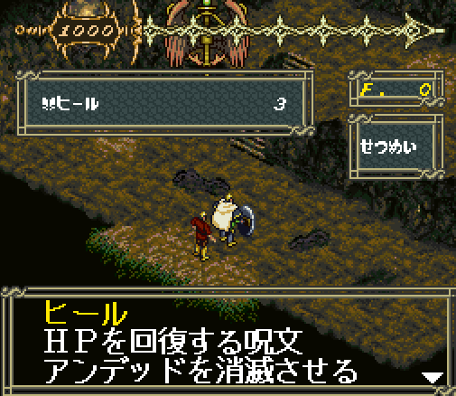 |  |

마법 `힐`의 설명문 자리에 **새로 확장한 글리프 영역**의 한글을 띄운 화면입니다.
`한글성공`은 프리픽스 `$5D`(글리프 인덱스 1024~1027), `확장`은 `$D5`(1280~1281)로
참조한 것이며, 둘 다 롬을 4MB로 늘려 새로 만든 뱅크 `$F0`에서 읽힙니다.

이 한 장이 세 가지를 동시에 증명합니다 — 프리픽스 인식, 인덱스 증가, 새 뱅크 읽기.
원래 엔진은 글리프 인덱스가 10비트여서 **1,024자가 절대 상한**이었고, 전량 번역에
필요한 약 1,200자를 담을 수 없었습니다. 렌더러를 패치해 상한을 없앴습니다.

| | |
|---|---|
| 메인 대사 번역 | **1,059 / 1,230** 세그먼트 (바이트 기준 **93.7%**) |
| 엔딩 텍스트 | **52 / 52** 조각 (**100%**) — 엔딩 4종 |
| 고유 음절 수용량 | 811자 → **1,253자** (엔진 패치, `F4`·UI한자 제외) |
| 사용 중 | 807자 (여유 446자) · 쌍둥이 6칸 · 평균 1.22 바이트/음절 |
| 한자 뱅크 식별 | 53자 → **560자** (대사 판독률 98.7%) |
| 단어표 `<EB>xx` | 56개 해독·번역 (본문 1,403곳 일괄 해결) |
| 이름표 | 마법 18개 · **장비 29개** · 몬스터 19개 · 화자·NPC 22개 |
| 세이브 화면 | 라벨 3개 + 문장 13칸 — **메뉴 폰트(4bpp 압축) 해독 완료** |
| 설정 화면 | 12항목 (`0x2FF706`) — 원문과 칸·바이트 동일, **실기 확인** |
| 오프닝 컷신 | **23줄 전문** (`0x9ED6E`) — 스프라이트 스크립트, 글리프 83자 |
| 롬 | 3MB → **4MB** (엔진 패치 기본 적용) |
| 검사 | 텍스트 **12층** + 삽입 역검증 **14단** + `test_kr` 10군 전부 통과 |

**대사 텍스트는 전부 끝났습니다.** 남은 171개 세그먼트에 번역할 문장은 없습니다 —
메뉴 레이아웃과 포인터 표이고, 바이트 값이 우연히 가나로 풀려 추출기가 텍스트로
잡은 것들입니다. 판별 과정은 [진행 중](#진행-중)에 적었습니다.

---

## 최근 작업 (2026-09-09)

하루에 화면 셋을 뚫었습니다. 세 번 다 **제 추론이 한 번씩 틀렸고**, 틀린 자리를
기록해 뒀습니다.

### 1. 세이브 화면 — 되돌렸다가 복구했다

메뉴 폰트(4bpp 압축) 코덱을 해독해 라벨 3개와 아래 문장 13칸을 넣었습니다.

| 원본 | 한글 |
|---|---|
| 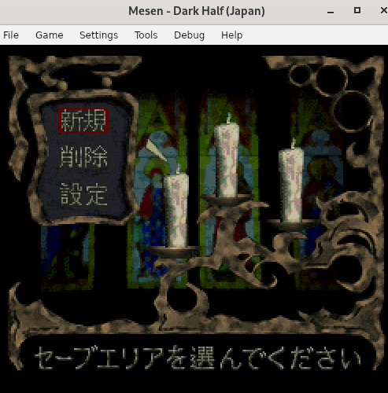 | 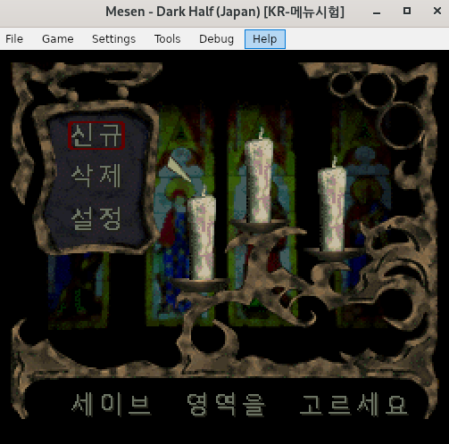 |

문장을 **한 번 되돌렸습니다.** 설정 화면이 같이 깨진 것을 보고 「폰트 시트가
공유라서 가나 교체가 번졌다」고 추론했기 때문입니다. **그 추론이 틀렸습니다.**
깨진 18자를 배정표에서 찾아보니 전부 **대사 폰트**에 배정된 글자였습니다.
`gfx.blocks()`로 확인하면 건드린 여섯 블록은 전부 엔트리 22 전용입니다.
근거가 없어졌으므로 복구했습니다.

**교훈** — 두 화면이 같이 깨졌다는 사실만으로 원인을 잇지 말 것. 깨진 **글자가
어느 폰트에 있는지** 확인하면 1분에 갈립니다.

### 2. 설정 화면 — 칸 = 바이트 − 이스케이프 수

깨진 글자의 **코드로 롬을 검색**해 텍스트를 `0x2FF706`에서 찾았습니다.
「면공가했」 = `92 6f 7e b0`. §4.9에서 이 구간을 「텍스트가 아니다」라고 판단한
것도 틀렸습니다.

| 깨진 상태 (대사 폰트 회수 자리) | 한글 |
|---|---|
| 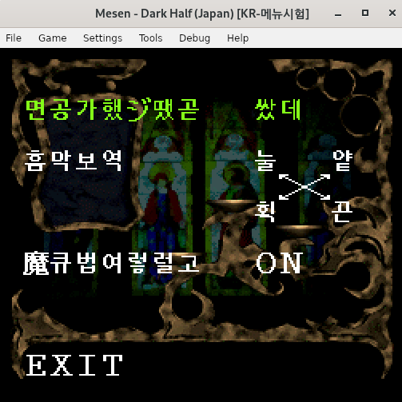 | 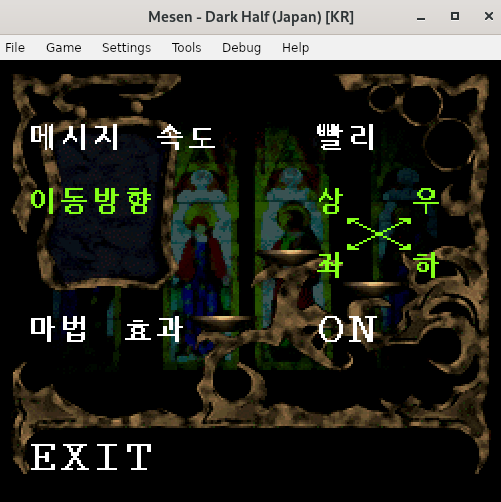 |

첫 시도는 바이트만 맞췄더니 **글자가 줄을 넘고 잘렸습니다.**

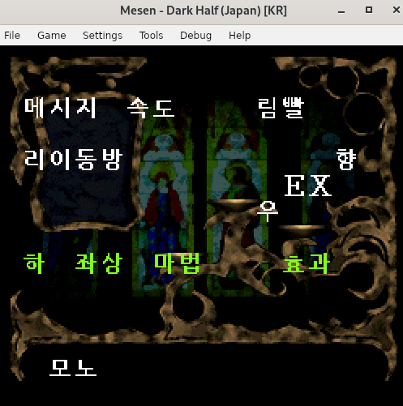

남는 공백 `0x20`도 1칸을 먹습니다. 정확한 제약은 이렇습니다.

```
바이트 = 2e + s + p = nb        (e=이스케이프, s=단일바이트, p=남는 공백)
칸     = e + s + p  = nb - e
```

**칸 = 바이트 − 이스케이프 수.** `nb`가 고정이니 **이스케이프 개수가 원문과
같아야**(`nb - nc`) 칸이 같습니다. 12항목 중 8개가 틀려 있었고, 양방향 수단을
각각 만들었습니다.

- **줄이려면 `force`** — 「테」「노」를 단일바이트로 승격해 「스테레오」「모노」를
  제대로 썼습니다. 대가로 대사 하나가 1바이트 넘쳐 「案ずるな」를
  「걱정 말라」로 줄였습니다.
- **늘리려면 쌍둥이 글리프** — 「우」는 단일바이트라 1바이트 1칸인데 원문 「右」는
  2바이트 1칸입니다. **같은 글자를 이스케이프 슬롯에도 하나 더** 뒀습니다
  (시·이·우·하·상·사 6자). 안전 슬롯 651칸이 전부 소진돼 있어 할당기에
  `reserve_safe`를 넣어 8칸을 예약했습니다.

`nc`를 손으로 적었다가 또 틀렸습니다 — 「メッセージ速度」를 8칸으로 셌는데
`7c 01`이 「シ + 탁음」이고 **`0x01`은 칸을 늘리지 않습니다.** 지금은
`orig_cells()`가 원본에서 세어 대조하므로 표가 틀리면 빌드가 멈춥니다.

### 3. 오프닝 컷신 — 여섯 번의 실패는 내 버그였다

텍스트가 아니라 **스프라이트**였습니다. 글리프는 엔트리 18의 압축 그래픽이고,
문장은 글자마다 `(타일 하위바이트, OAM 속성)` 2바이트인 스크립트입니다.

| 원본 | 한글 (패치 롬에서 렌더) |
|---|---|
| 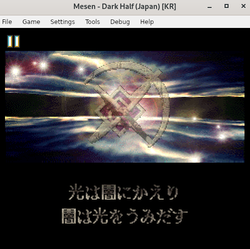 | 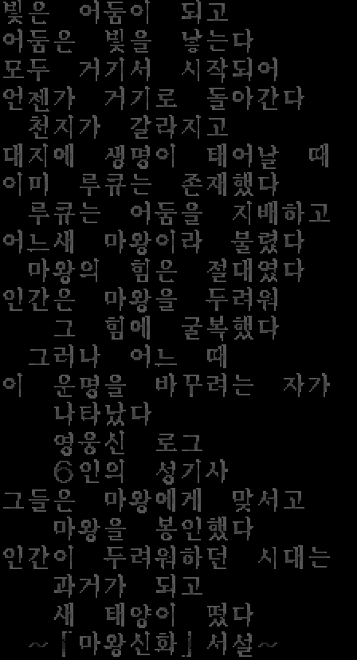 |

여섯 번 못 찾은 원인은 `gfx.blocks()`의 버그였습니다. 블록 목록 길이를
「첫 오프셋 ÷ 2」로 구했는데 엔트리 18·28은 **첫 항목이 `0xFFFF`(빈 블록)**
이라 32767개로 잡혀 표에서 제외돼 있었습니다. 오프닝은 정확히 그 안이었습니다.

글리프는 **스크린샷에서 직접 뽑아** 찾았습니다. 에뮬레이터 창이 정확히 2배
스케일이라 나누기만 하면 원본 픽셀이 나옵니다. Noto 템플릿은 0.70에 머물렀지만
(장식체라 TrueType 축소와 성질이 다름) 스크린샷 템플릿은 **15자 전부 IoU
1.000**이었습니다.

구조는 VRAM 덤프가 갈랐습니다. 배경 타일맵에 텍스트 타일 참조가 **한 군데도
없어** 스프라이트로 확정하고, 실제 VRAM 타일 번호를 스프라이트 이름 하위바이트로
바꿔 **간격 2**로 찾으니 한 곳이 나왔습니다.

시트는 내레이션 전체를 **중복을 뺀 첫 등장 순서**로 담고 있습니다 (88칸).

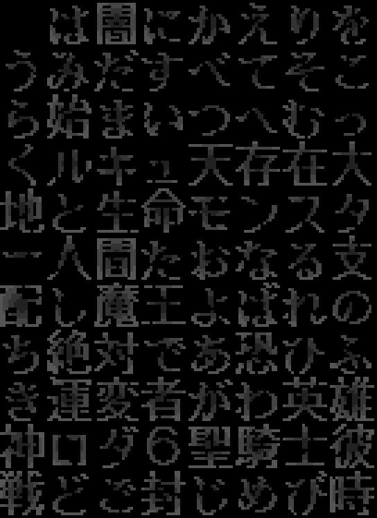

번역은 **줄마다 원문과 같은 칸 수**를 유지합니다(가운데 맞춤 + 공백 채움). 슬롯이
88칸뿐이어서 초안 93자를 83자로 줄였습니다. 4색 방사형 그라데이션은 재압축이
칸을 넘어 2색으로 근사했습니다 — 우리 packer가 원본의 역참조 명령을 안 내보내서
**원본 데이터를 그대로 재압축해도 넘칩니다**(블록5: 419 > 395).

### 4. 「일본어가 남았다」로 보인 것이 제어 파라미터였다

실기에서 워프 목록 한 항목이 깨졌습니다.

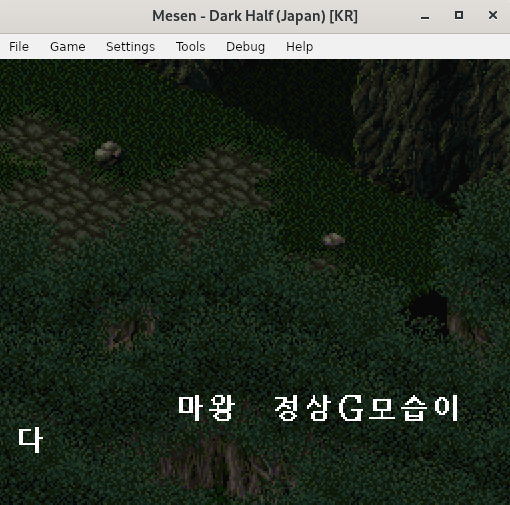

`#1078`~`#1096`이 워프 목록 19개고 원본은 전부 `<EE> c6 e0`으로 끝납니다.
추출기는 `c6`을 「に」로 읽지만 **텍스트가 아니라 `<EE>`의 인자**입니다.

증거는 분포였습니다. 19개 중 **5개만** 「에」로 바꿨고 14개는 「に」를 뒀는데,
깨진 것은 그 5개뿐입니다. 「に」가 화면에 안 보이던 이유도 같습니다 — 애초에
그려지지 않습니다.

되돌려 19/19가 원본과 같습니다. `trcheck`에 검사 [12]를 넣었습니다 — 원본과
번역에서 `<EE>` 다음 토큰이 같아야 합니다. 기존 「제어 코드 불일치」는 태그
**개수**만 보므로 못 잡았습니다.

**교훈** — 추출기가 텍스트로 읽어 준 글자가 전부 텍스트는 아닙니다. 제어 코드
바로 뒤는 인자일 수 있고, 그때는 **일본어로 남겨 두는 것이 맞습니다.** 그리고
같은 구조가 여럿일 때는 **전부 같게 처리해야** 합니다.

### 오늘 남은 것

목록 창(마법·아이템·장비)과 파티 상태창이 아직 메뉴 폰트를 씁니다.

| 원본 | 깨진 상태 |
|---|---|
| 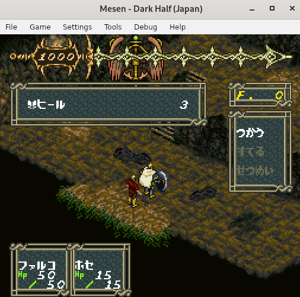 | 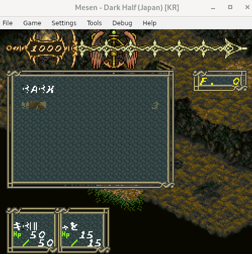 |

**원인은 버그가 아니라 미완성이었습니다.** 장비 이름표에 15개만 번역돼 있고
13개가 일본어로 남아 있었습니다 — 미번역 일본어는 회수된 가나 슬롯을 가리키니
반드시 깨집니다. 13개를 번역해 장비 이름 29개가 전부 한글이 됐습니다.

**아이템 이름·설명 상자**는 대사 폰트를 씁니다 — 필요한 글리프만 64바이트 통째로
VRAM `0x3000`부터 올리고 뱅크 이스케이프도 해석합니다(VRAM 덤프에서 바이트 단위
확인).

**마법 목록이 깨지고 화살표를 움직이면 화면 전체가 붕괴하던 원인은 제 패딩이었습니다.**
`patch_words`·`patch_names`가 남는 칸을 `0xFF`로 채웠는데, 원본 표에는 연속 `0xFF`가
**한 쌍도 없습니다**(0xFF 패딩 후 마법표 31쌍, 단어표 67쌍). 표를 `0xFF` 구분자로
순차 주사하는 루틴이 그것을 **빈 엔트리**로 읽어 인덱스가 밀리고, 밀린 채 표를 넘어
뒤쪽 `0xFF` 채움 구간(15,773바이트)까지 읽어 폭주합니다 — `broken.dmp`에 `0xFF`가
**9,886바이트 연속**으로 찍혔습니다(정상 덤프는 0개).

남는 칸을 **공백(`0x20`)**으로 채우고 종료자를 **원래 자리**에 두어 고쳤습니다.
역검증 `[13]`이 표마다 연속 `0xFF` 쌍 수를 원본과 대조합니다.

위 캡처는 `F4` 제거와 메뉴 안전 슬롯 도입과 같은 날(09-08)이라 **이미 고쳐진
증상일 가능성**이 있습니다. 현재 빌드로 다시 확인해야 합니다.

다만 확실한 결함이 하나 있습니다. 아이템 창은 공용 시트(엔트리 22) 블록 7~13을
올리고, 그 타일맵이 블록 11 타일 8(`さ`)을 참조합니다. **세이브 화면 문장이 그
칸을 덮습니다** — 한 글자가 깨집니다.

---

## 목적

이 게임은 마왕과 용사를 번갈아 조작하는 구조 때문에 **대사 이해가 곧 게임 이해**입니다.
전투 시스템보다 텍스트 비중이 크고, 그 텍스트가 전부 일본어라 한국어권에서는
사실상 플레이가 불가능한 상태입니다.

목표는 **전체 한글화**입니다. 화면에 나오는 모든 문자열을 한국어로 바꾸는 것이며,
부분 번역·혼용 상태로 남기지 않습니다.

부차적 목표로, 진행 과정에서 확인한 롬 내부 구조(인코딩, 폰트 배치, 포인터 테이블,
제어 코드)를 전부 문서로 남깁니다. 같은 게임을 다시 건드리는 사람이 처음부터
분석을 반복하지 않도록 하는 것이 목적입니다.

---

## 진행 방향

### 원칙 1 — 제자리 삽입만 사용한다

번역문 길이를 늘려 텍스트를 재배치하는 방식(리포인팅)은 **시도했고 실패했습니다.**
게임이 메뉴 화면에서 정지합니다. 원인은 뱅크 0x04 밖에도 이 텍스트를 가리키는
테이블이 있고(`0x052128`, `0x054c41`, `0x0a045f` 등), 포인터가 전혀 없는 고아 런이
254개(5,025바이트) 존재하기 때문입니다. 포인터 전수 조사도 오탐률에 막혀 실패했습니다.

따라서 **번역문을 원본과 동일한 바이트 길이로 제자리에 써넣고, 남는 자리는
공백(`0x20`)으로 채웁니다.** 주소가 하나도 바뀌지 않으므로 미갱신 참조 문제가
구조적으로 발생하지 않습니다.

### 원칙 2 — 한글을 1바이트 코드에 태운다

원작은 '자주 쓰는 한자 = 1바이트, 드문 한자 = 2바이트' 압축을 씁니다.
같은 전략을 그대로 씁니다. 빈도 상위 음절을 1바이트 코드에 배정하고
나머지를 2바이트 이스케이프에 넣습니다.

렌더러를 코드로 확정한 결과, 이스케이프는 별개 뱅크가 아니라 **10비트 글리프
인덱스의 상위 비트**였습니다 (`darkhalf-kr/PROGRESS.md` 1.2.1).

| 슬롯 | 개수 | 비고 |
|---|---|---|
| 단일바이트 | 142 | `0x20-0xDF` 중 보존 코드, 프리픽스 `$5D`/`$D5`, `♥`(`0xA0`) 제외 |
| ~~`F4 xx`~~ | ~~57~~ | **배정에서 제외** — 아래 참조 |
| `F5 xx` | 255 | |
| `F6 xx` | 255 | |
| `F7 xx` | 95 | 실제 글리프 62 + 미사용 33. 나머지 160은 엔딩 텍스트·미식별 데이터 |
| `$5D xx` | 255 | **엔진 패치로 추가.** 인덱스 1024~ → ROM `0x300000` |
| `$D5 xx` | 255 | **엔진 패치로 추가.** 인덱스 1280~ → ROM `0x304000` |
| **총 수용량** | **1,253자** | 고유 음절 상한 (사용 807자, UI한자 4칸 제외) |

**`F4` 57칸을 버렸습니다.** 두 가지가 겹쳤습니다.

- `F4_SLOTS`(`0x00-0x1F`, `0xE6-0xFF`)의 글리프를 **원본이 쓰고 있습니다** —
  `0x00` 魔, `0x04` ◀, `0x05` ▶(메뉴 화살표), `0x06`~`0x1F` 탁음 가나.
  한글을 배정하면 그 글리프가 덮입니다. 실제로 57칸 전부 덮고 있었습니다.
- `F4`의 둘째 바이트는 **항상 제어 코드 값**입니다. `F4`를 처리하지 않는
  메뉴·표 렌더러가 그것을 제어 코드로 읽고 게임이 멈춥니다.

그리고 세 가지가 슬롯을 더 깎았습니다. 전부 화면이 깨진 뒤에 알아낸 것입니다.

- **`0xA0`(♥) 보존** — 본문 문장부호가 아니라 마법·아이템 목록의 커서 표시입니다.
  회수했다가 아이템 창에 이름 앞 글자가 엉뚱하게 나왔습니다.
- **이스케이프 둘째 바이트에서 `0xFF` 제외** — `0xFF`는 문자열·메시지 종료자입니다.
  어떤 음절이 `F6 FF`를 받으면 표 판독이 첫 바이트에서 끊깁니다.

- **메뉴·표 음절은 둘째 바이트 `0x20` 이상**만 받습니다 (안전 슬롯 651칸).
  `0x20` 미만이면 메뉴 렌더러가 제어 코드로 읽습니다.

`$F4`를 4번째 프리픽스로 발견해 58자를 확보했던 것은 결국 되돌렸습니다.
원문이 `F4 00`=魔 `F4 01`=士 `F4 02`=見 형태로 153회 쓰고 있어서, 그 자리는
원본에게 돌려주는 것이 맞았습니다.

원래 엔진의 주소 지정 상한은 1,024글리프였습니다. 이것만으로는 전량 번역에
필요한 약 1,200자를 담을 수 없어, **렌더러를 패치해 인덱스를 11비트로
넓혔습니다** (아래 '엔진 패치' 참조). 실기 검증 완료.

### 원칙 3 — 가나 회수는 되돌리지 않는다

가나 글리프 자리를 한글로 덮으면 **아직 번역하지 않은 일본어가 깨집니다.**
한때는 부분 번역 상태에서 가나를 보존하려 했습니다(`DH_KEEP_KANA=1`).
측정해 보니 쓸 수 없었습니다.

| | 회수 | 보존 |
|---|---|---|
| 단일바이트 슬롯 | 142 | 32 |
| 평균 | 1.20 바이트/음절 | 1.50 |
| 예산 초과 세그먼트 | **0** | **354 / 535** (최대 96바이트) |

그래서 회수를 유지합니다. 남은 일본어가 깨져 보이는 것은 이 설계의 필연이고
전량 번역으로만 해소됩니다. 지금 깨져 보이는 것은 미번역 대사, 엔딩,
그리고 아직 손대지 않은 아이템·몬스터·인물 이름표입니다.

### 원칙 4 — 추정 위에 다음 단계를 쌓지 않는다

메뉴 폰트 추적에 6회 실패했고 원인은 전부 동일했습니다: VRAM에서 대상 위치를
확정하지 않은 채 감시 지점을 추측으로 정했습니다. 확정되지 않은 사실은
`PROGRESS.md`에 '미해결'로 남기고, 그 위에 작업을 얹지 않습니다.

---

## 진행 경과

### 완료

**인코딩 해독** — 1바이트 코드 체계 확정. 가나가 반각 가타카나 Shift-JIS 코드
자리에 배치돼 있고 글리프만 히라가나로 렌더됩니다. 전체 테이블은 `darkhalf.tbl`.

**제어 코드 해독** — `0xFF` 메시지 종료(포인터 목적지 직전 58/58 일치),
`0x01` 탁점 결합, `0xE3` 개행, `0xF5/F6/F7 xx` 한자 뱅크. 약 20개는 미해독이지만
원본을 보존하면 번역에 지장이 없습니다.

**폰트 구조 확정** — 16x16 / 2bpp / 64바이트per글자 / 타일순서 TL,TR,BL,BR.
단일바이트는 `0x2F0000 + code*64`, 뱅크는 `0x2F4000`/`0x2F8000`/`0x2FC000` 기준.

**텍스트 구간 확정** — 메인 대사 `0x040C00-0x04F800` (59KB, 세그먼트 1,235개),
마법 설명문 `0x05B000-0x05B800`, 추가 설명문 `0x05BC00-0x05C400`,
엔딩 `0x2FD000` 부근.

**포인터 매핑** — 뱅크 0x04의 u16 포인터 1,536개 → 런 991개.
전체 기록은 `ptrmap.py <rom>`으로 재생성합니다(원본에서 바이트 단위로 동일).

**파이프라인 구축 및 검증** — 추출 → 번역 → 삽입 왕복 시 원본과 **0바이트 차이**.

**한글 폰트 생성** — NanumGothicBold 14pt → 16x16 글리프. 왕복 검증 포함.

**UI 한글화 (실기 확인)** — 메뉴 라벨 13개 + 마법·아이템 설명문 20개.
설명문과 예/아니오는 정상 출력됩니다.

**한자 뱅크 식별 (553자)** — 대사 번역의 선행 조건이었습니다. 식별 전에는 추출한
스크립트가 `ここが<EB><19>を<A82><A9C><A9D>にかえてくれるところです` 형태로 나와
번역 자체가 불가능했습니다.

| 항목 | 전 | 후 |
|---|---|---|
| 식별된 뱅크 한자 | 53자 | **553자** |
| 메인 대사 한자 커버리지 | 11% | **97.9%** (3,610/3,688회) |
| 완전 판독 가능 메시지 | — | **98.7%** (1,033/1,047) |

3단 절차로 진행했습니다. **시각 매칭은 후보를 좁히는 역할만** 하고 확정은 문맥이
합니다 — 시각 top-8에 없던 글자도 문맥으로 풀립니다 (`間`=仲間になった,
`闇`=闇に封じられし千年, `階`=長い階段, `問題`=悪くない質問だ).
검증은 렌더 역검증(IoU)과 시각 시트 전수 확인을 병행해 오식별 4건을 잡았습니다.

**렌더러 글리프 경로 확정** — 추정이 아니라 코드로 확정했습니다.

| 주소 | 역할 |
|---|---|
| `0x005cfa` / `0x00950f` | 이스케이프 판별. `CMP #$F8` / `CMP #$F4` / `AND #$03` |
| `0x005cf1` / `0x0094a5` | 다음 텍스트 바이트 읽기 |
| `0x005c96` | 글리프 페치. `ASL×6` (×64) → `LDA $EF0000,X` |
| `0x009544` | DMA 큐 설정. 소스 뱅크 `$EF`, 오프셋 `인덱스×64`, 크기 `#$0040` |
| `0x005d0c` | 결합 부호 처리. 다음 바이트가 `0x00`~`0x02`면 앞 글자 인덱스 보정 |

**번역 파이프라인 구축** — 판독 추출, 예산 검사, 우선 배정, 삽입 5단 역검증.
`test_kr.py`가 10개 그룹을 검사하고, 그중 [10]은 1,669개 세그먼트 전부에서
'판독문 → 인코딩'이 표시를 보존하고 길이를 늘리지 않는지 확인합니다.
이 불변식이 인코더 버그 3건을 잡았습니다 (아래 참조).

**엔진 패치 — 글리프 인덱스 11비트 확장 (실기 검증 완료)**

검증 화면은 [최상단](#현재-상태)에 있습니다. 원래 엔진은 글리프 인덱스가 10비트여서 **1,024자가 절대 상한**이었습니다.
전량 번역에 약 1,200자가 필요해 렌더러를 패치했습니다.

핵심은 발견한 성질 하나입니다. 인덱스 1024를 `ASL×6`(×64)하면 `0x10000`이 되어
**16비트에서 하위 `0x0000`으로 자연히 감깁니다.** 즉 하위 16비트는 이미
"다음 뱅크 내 오프셋"으로 정확하고, 바꿀 것은 뱅크 바이트 하나뿐입니다.

```
뱅크 = $EF + ($6A >> 2)
```

| 주소 | 변경 | 크기 |
|---|---|---|
| `0x00950F` | `JMP $F200` — 이스케이프 판별 확장 (메인 대사 렌더러) | 39바이트 |
| `0x005CFA` | `JMP $F260` — 이스케이프 판별 확장 (옵션·엔딩 렌더러) | 37바이트 |
| `0x009548` | `JMP $F300` — DMA 꼬리 재구성, 뱅크 계산 | 63바이트 |
| 롬 크기 | 3MB → 4MB (뱅크 `$F0` = ROM `0x300000`) | |

`$6A`는 `0x9552`의 `STA $69`(16비트)에서 덮이므로 뱅크 계산을 인덱스 시프트보다
**먼저** 해야 했고, 그래서 `0x9548` 이후 꼬리를 빈 공간으로 옮겨 재구성했습니다.

프리픽스로는 `$5D`(備)·`$D5`(ゆ)를 씁니다. 이 두 바이트는 우리가 번역하지 않는
구간(설명문 A·B, 옵션·엔딩 텍스트)에서 한 번도 쓰이지 않습니다. 뱅크 계산이
`$6A >> 2`이므로 `$6A`=6,7 (인덱스 1536~2047)도 **코드 변경 없이** 쓸 수 있어
확장 여지가 남아 있습니다.

부작용 둘: 이 두 바이트를 단일바이트 글리프로 배정할 수 없어 슬롯이 145→143으로
줄었고(기존 설명문 2개가 1바이트씩 넘쳐 문구를 줄였습니다), 아직 번역하지 않은
일본어 중 `備`/`ゆ`가 든 것은 깨져 보입니다 (전량 번역 시 해소).

**단어표 `<EB>xx` 해독 (56개) — 본문 1,403곳이 한 번에 해결**

대사에 `<EB>xx`가 51종 1,403회 나옵니다. 문법으로 보면 명사 자리인데, 오래
미해독으로 남아 있었습니다. 프로브 롬으로 실기 확인해 정체를 확정했습니다.


설명문 자리에 `<EB><04> <EB><14> <EB><15> <EB><16>`를 넣으니 네 단어가 그대로
그려졌습니다. 정적 단어표이고, 인덱스 규칙은 `<EB>N` → 엔트리 `[N-1]`입니다.

| | |
|---|---|
| 포인터 표 | `0x05c0a6`, 56엔트리 — 문자열 시작과 56/56 일치 |
| 문자열 | `0x05c11a ~ 0x05c262`, 각 `0xFF` 종료 |

곁가지로 UI 메시지표(`0x040000`)와 아이템·장비 이름표(`0x040260`) 위치도
확인했습니다.

**이름표는 제자리로만 쓴다** — 문자열을 재배치하고 포인터 표를 갱신했다가
메뉴 진입에서 게임이 멈췄습니다. 그 문자열을 가리키는 곳이 하나가 아니었습니다.
마법 이름의 경우 포인터 표(`0x040300`) 외에 4바이트 레코드 표(`0x04f139`)와
**설명문 본문에 박힌 `F0 C4 <포인터>`**(`0x05b517`)가 더 있었습니다.
그래서 각 엔트리를 원본 시작 주소에 그대로 덮고 포인터 표는 건드리지 않습니다.
아직 못 찾은 참조가 있어도 어긋나지 않습니다.

**해독이 드러낸 조사 오류 90건** — 단어가 런타임에 끼워지므로 뒤 조사의 형태는
그 단어의 종성에 달렸습니다. 무엇이 들어오는지 모르던 동안 「파티아을」·「마물가」
같은 것이 그대로 있었습니다. `wordfix.py`로 일괄 수정했습니다. 다만 호격 「아」와
계사 「이야」는 형태를 공유해 규칙으로 가를 수 없어, 4건은 문맥으로 판단했습니다.

**통합 빌드 `build.py`** — `pipeline insert`와 `patch_all`이 각자 배정하고 각자
폰트를 덮던 것을 하나로 합쳤습니다. 배정 한 번, 폰트 한 번, 체크섬 한 번입니다.
`trcheck`도 같은 `build.plan()`을 호출합니다 — 한때 게이트가 689자, 빌드가 703자로
갈려 게이트만 초과를 보고했습니다. **게이트가 정본과 다르면 게이트가 아닙니다.**

### 진행 중

**메인 대사 번역 — 텍스트는 전부 끝났습니다**

| | |
|---|---|
| 번역 완료 | **1,059 / 1,230** 세그먼트 (86.1%) |
| 바이트 기준 | 54,435 / 58,113 (**93.7%**) |
| 고유 음절 | 807 / **1,253** |
| 최종 인벤토리 외삽 | 약 835자 (여유 422자) |
| 예산 초과 | 0개 |
| 삽입 역검증 | 14단 전부 통과 |

남은 171개 중 **번역할 문장은 없습니다.** 96개는 필터를 통과하지만 전부 메뉴
레이아웃과 포인터 표입니다 — 제어 코드 사이에 가나가 파라미터로 박혀 있어
추출기가 텍스트로 잡습니다. 나머지 75개는 아이템표·접미사 공유·`F7` 비글리프로
걸러진 것들입니다.

예를 들어 `#1318` 은 `<F9>xx` 가 열한 번 반복되는 화자 이름 포인터 표인데 끝이
「いぬ」로 풀립니다. 「개」가 아니라 포인터 값입니다. `#163` 의 「ＦＬＧ ０１」,
`#165` 의 「ＴＩＭＥＥＣＮＴＳＭＡＰ」는 디버그 화면 라벨입니다.

이 층을 걸러내는 데 세 단계가 필요했습니다.

| 기준 | 걸러낸 것 | 놓친 것 |
|---|---|---|
| `--prose` 가나·한자 4연속 | 산문 | 짧은 대사 전부 |
| `--text` 가나 3연속 | 대사 대부분 | 「許さぬ」처럼 가나가 2연속인 한자 혼합 |
| 인용부호 + 한자·가나 인접 | `#215` `#316` `#509` `#1167` | `<EB>N さん` 형태 (`#713` `#714`) |
| 제어 태그 제거 후 육안 | `#638` `#643`, 화자 이름표 | — |

마지막 단계에서 **화자 이름표를 찾았습니다** (`0x04f8aa`~`0x04f92e`). PROGRESS 에
"위치 불명"으로 남아 있던 표입니다. 노파·용병Ａ~Ｉ·시체·분신·두목·숭배자 같은
일반 NPC 라벨과 레이·호세·바무·다브가 여기 있습니다.

세그먼트 수보다 바이트 진행률이 앞서는 것은, 이야기가 몰린 긴 세그먼트를
줄거리 순서대로 먼저 옮기고 있기 때문입니다. 배치 39 의 `#648`(441바이트),
`#649`(544바이트)가 그런 예입니다.

수용량이 1,321자가 되어 필요량 약 1,200자를 넘겼으므로, 어휘를 극단적으로 줄일
필요가 없어졌습니다. 문체 방침과 용어는 `darkhalf-kr/GLOSSARY.md`에 있습니다.

배치마다 `trbatch.py new`로 새 음절을 확인하고, `trcheck.py`가 세그먼트별 예산
초과와 진행률별 인벤토리 가드레일을 검사합니다.

**주의**: 예산 초과는 세그먼트별이 아니라 전역으로 얽힙니다. 인벤토리가 커지면
단일바이트를 받던 음절이 2바이트로 밀려 **이전에 통과했던 세그먼트가 나중에
초과로 바뀝니다.** `tralloc`의 우선 배정이 완화하지만 없애지는 못합니다.

**엔딩 텍스트 번역 — 완료**

| | |
|---|---|
| 번역 완료 | **52 / 52** 조각 (100%) |
| 바이트 기준 | 615 / 615 (100%) |

엔딩은 대사와 다른 렌더러(`0x005666`)를 쓰고 폰트 영역 안(`0x2FCFC0`~)에 있습니다.
포인터 표가 4개뿐이라 재배치도 가능하지만 제자리로 했습니다 — 표를 건드리지 않으면
참조 문제가 없습니다.

**엔딩은 4종입니다.** 포인터 표 네 항목이 각각 다른 엔딩을 가리킵니다.

| 포인터 | 오프셋 | 크기 | 내용 |
|---|---|---|---|
| `0x008` | `0x000`~`0x0b0` | 176B | 「네 손으로 모든 인간이 빛을 품는 때가 오면」 — 팔코에게 남기는 부탁 |
| `0x0b9` | `0x0b1`~`0x139` | 136B | 팔코가 팔찌와 세계를 맡는다 |
| `0x142` | `0x13a`~`0x251` | 279B | 루큐가 세계를 물에 가라앉히고 새 생명을 보낸다 |
| `0x25a` | `0x252`~`0x365` | 275B | 루큐가 모든 생명을 없애고 허공에 잠긴다 |

### 본문 범위를 잘못 잡았던 일

처음에 본문을 `BODY`~`0x2FF780` (10,168바이트) 로 보고 "엔딩 179조각 7,294바이트"라고
적었습니다. 틀렸습니다. 포인터 표는 4개고 각 블록은 첫 `0xFF` 에서 끝나므로, 실제
엔딩은 **866바이트, 가나 포함 52조각**입니다.

`0x366` 이후 6.6KB 는 엔딩이 아닙니다. 바이트 값이 우연히 가나·한자로 풀리는 미식별
데이터이고(「`<魔>ク<魔>み`」 같은 짧은 `0xFF` 종료 레코드가 반복됩니다), 포인터가
4개뿐이라 렌더러가 닿지도 않습니다. **여기에 쓰면 안 됩니다.**

`ending.TEXT_END = 0x366` 을 두고 `patch_ending.load()` 가 이 밖을 걸러냅니다.
상수는 `ending.text_end(rom)` 가 포인터 표와 `0xFF` 위치로 다시 계산해 검증합니다.

### 조각당 예산이 거의 없다

조각은 줄바꿈(`0xF1`) 단위로 끊기고 8~17바이트입니다. 원문은 앞 공백으로 가운데맞춤이
돼 있고, **이 공백이 예산입니다.** 넘칠 때는 공백을 줄이거나 2바이트 음절을 피해
고쳐 씁니다.

`endbatch.py cost` 가 조각별 비용과 어떤 음절이 2바이트인지 보여줍니다. 이걸로 본
사실 하나 — **주인공 이름 음절이 비쌉니다.**

| 음절 | 출현 | 빈도 순위 | 비용 |
|---|---|---|---|
| 루 | 12회 | 282위 | 2바이트 |
| 큐 | 4회 | 477위 | 2바이트 |
| 코 | 20회 | 206위 | 2바이트 |

단일바이트 컷 근처는 30~37회짜리 음절입니다. 이름을 강제 배정하면 36회를 얻고
105회를 잃습니다. 그래서 강제하지 않고 공백을 줄여 맞췄습니다.

번역이 끝난 뒤 `endbatch.py center` 로 정렬을 다시 잡습니다. 원문 가운데맞춤은 손으로
넣은 것이라 딱 떨어지는 식이 없어서(같은 폭인데 앞 공백이 다릅니다) 식을 새로 만들지
않고 원문 배치를 기준으로 삼습니다 — `앞공백 = 원문앞공백 + (원문폭 - 한국어폭) // 2`,
예산이 모자라면 예산이 이깁니다.

### 엔딩을 강제 배정에서 뺀 이유

엔딩 22조각을 넣자 대사 예산 초과가 2개에서 72개로 뛰었습니다. 강제 배정이 80자까지
불어 단일바이트 142칸의 절반을 넘게 잡은 탓입니다.

거래를 따져 보면 손해가 분명합니다. 엔딩 조각이 1바이트 넘치면 그 조각 음절 열 개가
전부 강제 배정을 받습니다. 1바이트를 아끼려 칸 열 개를 쓰고, 밀려난 고빈도 음절은
대사 1,000개에 걸쳐 비용을 냅니다.

단어표·이름표는 칸이 고정(`腕輪`은 2바이트)이라 강제가 유일한 수단이지만, 엔딩
조각은 고쳐 쓸 여지가 넓습니다. 그래서 엔딩 초과는 사람이 문장을 고쳐 해결합니다.

| | 전 | 후 |
|---|---|---|
| 강제 배정 | 80자 | **32자** |
| 단일바이트 담당 | 출현의 76% | **79%** |
| 평균 | 1.24 B/음절 | **1.21 B/음절** |
| 대사 예산 초과 | 72개 | **0개** |

### 대기

1. **이름표를 메뉴에서 읽히게 하기** ← 판단 대기.
   위 [이름표는 강제 배정으로 풀 수 없다](#이름표는-강제-배정으로-풀-수-없다--판단-대기)
   참조. 인물 이름 12개만 강제하면 대사 20곳 다듬기로 파티 상태창이 한국어가 됩니다.
2. **아이템·장비 이름표** (`0x040260`, 130엔트리) — **손대지 않기로 판단**.
   문자열 95개 중 11개가 다음 엔트리를 침범해 제자리도 재배치도 막혔습니다
   (PROGRESS 4.7).
3. **몬스터 이름표** (`0x04f672`) — 겹침은 없어 19개 번역 완료. 나머지는 접미사
   공유(`<EE>`) 10개와 `F7` 비글리프 참조 5개로 막혀 있습니다 (PROGRESS 4.10).
4. **§4.1 메뉴 폰트** — 목록 창이 ROM→WRAM→VRAM 경로로 폰트를 따로 올립니다.
   `problem_013`(목록 창이 빈 채로 뜸)·`problem_014`(우측 패널)가 그 증상입니다.
5. 설명문 B 구간(`0x05BC00-0x05C400`) 번역

`patch_all.py`는 **은퇴**했습니다. 자체 배정으로 폰트를 따로 덮고, `MENU` 13개가
이미 대사 TSV에서 번역된 세그먼트를 잘라 먹었습니다. `build.py`가 정본입니다.

### 검사 체계

번역문 검사 12층(`trcheck.py`)과 삽입 후 역검증 14단(`verify_insert.py`)입니다.
**층이 늘어난 것은 전부 화면이 깨진 뒤에 원인을 찾아 추가한 결과입니다.**
검사 하나하나가 실제로 겪은 사고의 이름입니다.

| 텍스트 검사 | 무엇을 막는가 | 어떤 사고에서 나왔나 |
|---|---|---|
| 예산 초과 | 원본 길이를 넘는 번역 | — |
| 인코딩 불가 | 게임 테이블에 없는 문자 | — |
| 일본어 잔존 | 번역을 빠뜨린 가나·한자 | — |
| 고아 프리픽스 | `<F4>`만 남아 다음 글자를 먹는 상태 | 배치 37 |
| 조사 불일치 | 단어표가 끼우는 단어의 종성과 어긋난 조사 | 90곳 일괄 |
| 장음 부호 | `ー`(`0xB0`)가 텍스트에 남은 상태 | — |
| 한글 속 한자 | 한국어 낱말 안에 한자 이스케이프 잔존 | 30곳 |
| 표 침범 | 표 문자열을 대사로 번역 | 배치 42·65·79 |
| 제어 코드 불일치 | 제어 바이트를 지우거나 더한 것 | §4.11 메뉴 정지 |
| 선택 항목 | 선택 필드에 이스케이프·칸 수 불일치 | §4.15.3 |
| 엔딩 예산 | 엔딩 조각이 제자리 예산을 넘김 | §4.16 |

| 역검증 | 무엇을 확인하는가 |
|---|---|
| [1] | 번역 세그먼트 바이트가 인코더 출력과 일치 |
| [2] | 미번역 세그먼트가 원본 그대로 |
| [3] | 폰트 변경 슬롯이 배정과 정확히 일치 (새 뱅크 `$F0` 포함) |
| [4] | 각 슬롯의 글리프 내용이 맞음 |
| [5] | 허용 영역 밖 변경 0바이트 (엔진 패치 자리 제외) |
| [6] | 단어표가 제자리에 있고 포인터 표 무변경 |
| [7] | 이름표가 제자리에 있고 포인터 표 무변경 |
| [8] | 엔딩이 제자리에 있고 포인터 표 무변경 |
| [9] | 메뉴·표 영역에 위험 이스케이프 없음 |
| [10] | 설정 화면 12항목이 인코딩·바이트로 일치, `nc` 가 원본 칸 수와 일치 |
| [11] | 메뉴 폰트 글리프 19개 — 풀어서 타일 비교 (압축이라 바이트 비교 불가) |
| [12] | 오프닝 23줄 스크립트 바이트 + 글리프 83자 |

`test_kr.py`는 10개 그룹을 검사합니다. 그중 [10]은 1,669개 세그먼트 전부에서
'판독문 → 인코딩'이 표시를 보존하고 길이를 늘리지 않는지 확인하고, [3b]는
어떤 배정도 `0xFF`로 끝나지 않음을 확인합니다.

**예산 관련 실무 지식 하나** — 음절 수가 아니라 배정 상태가 예산을 정합니다.
5음절을 4음절로 줄여도 초과가 그대로일 수 있습니다. 새 음절이 2바이트 코드를
받았기 때문입니다. 그때는 단일바이트 배정 목록에서 골라야 합니다.

### 고아 프리픽스 — 바이트 역검증이 구조적으로 못 잡는 층

배치 38 시점에 12개 세그먼트에서 발견했습니다. 원문 `悪<F4><魔>`를 「악마」로
옮길 때 `<魔>`만 지우고 프리픽스 `<F4>`를 남긴 것입니다.

검증 세 층이 모두 통과시킵니다.

| 층 | 판정 | 이유 |
|---|---|---|
| 인코더 | 통과 | `<F4>`를 요청받은 대로 `0xF4` 한 바이트로 내보낸다 |
| 예산·인코딩 검사 | 통과 | 길이와 매핑만 본다 |
| 삽입 5단 역검증 | 통과 | ROM 과 **인코더 출력**을 비교한다 |

마지막 층이 핵심입니다. 인코더 출력 자체가 틀렸으므로 그것과 ROM 을 비교해
봐야 아무것도 드러나지 않습니다. 그런데 렌더러는 `0xF4`를 이스케이프
프리픽스로 읽고 **다음 바이트를 글리프 인덱스로 먹습니다.** 「악마다」가
「악」+(엉뚱한 글리프)+「다」가 되어 한 글자가 사라지고 다른 글자가 끼어듭니다.

바이트 층에서 잡을 수 없으므로 **텍스트 층**에서 막았습니다. `trcheck.py`에
고아 프리픽스 검사를 추가했고, `<F4><魔>`처럼 태그 뒤에 태그가 오는 정상
형태는 `(?!<)`로 제외합니다. 추가 직후 배치 39 에서 6건을 곧바로 잡았습니다.

교훈: **역검증의 기준점이 검증 대상과 같은 함수를 통과했다면, 그 층은 그
함수의 오류를 볼 수 없습니다.** 층을 하나 위로 올려야 합니다.

### 인코더 버그 3건 — 불변식이 잡은 것

번역을 시작하자마자 드러났습니다. 셋 다 화면을 깨뜨리는 종류였습니다.

1. **탁음이 제어 바이트로 인코딩됨** (1,669개 중 889개 영향). 원본은 「が」를
   `か`(0xB6) + `0x01`로 저장하는데, 인코더가 완성형 슬롯 `0xE6`을 골라
   1바이트로 내보냈습니다. `0xE6` 이후 완성형 탁음 슬롯은 이 게임이 제어
   코드로 재활용하므로, 일본어 탁음 가나가 하나라도 남으면 제어 바이트가
   박혔습니다.
2. **`士`를 맨바이트 `0x01`로 내보냄**. 렌더러는 *다음* 바이트가 `0x00`~`0x02`면
   앞 글자의 인덱스를 보정하므로, 한자 뒤의 맨 `0x01`은 앞 한자를 엉뚱한
   글리프로 바꿉니다. 원문이 `F4 01`을 쓰는 이유가 이것입니다.
3. **폰트 주소 계산 복사본 4곳**이 `F4`를 몰라 죽었습니다. `pipeline.FONT_BASE`
   한 곳으로 통합했습니다.

### 렌더러가 셋이다 — 이스케이프를 어디까지 이해하는가

이 프로젝트에서 가장 값비쌌던 발견입니다. 한글을 2바이트 이스케이프에 태우는데,
**그 이스케이프를 이해하는 정도가 화면마다 다릅니다.**

| 층 | 이스케이프 | 둘째 바이트 `<0x20` | 어디에 쓰이나 |
|---|---|---|---|
| 대사 렌더러 (`$950F`, 패치됨) | 전부 이해 | 괜찮음 | 이야기 대사, 설명문 |
| 메뉴·표 렌더러 | `F5`~`F7` 만 | **제어 코드로 읽음** | 아이템·이름표, 시스템 메시지 |
| 선택 필드 (`<ED>出 … <ED>`) | **이해 못 함** | — | 예/아니오, 명령 메뉴 |

세 층을 구분하지 못해 같은 증상을 다섯 번 고쳤습니다.

**1. `F4` 는 유독 위험합니다.** `F4 xx` 는 글리프 `xx` 를 가리키는데, 단일바이트로
쓸 수 있는 글리프는 단일바이트로 쓰므로 `F4` 에는 *바이트 값이 제어 코드와 겹쳐
단일바이트로 못 쓰는 글리프만* 남습니다. 즉 **둘째 바이트가 항상 제어 코드
값**입니다. `#1222` 「진형」이 `f4 1f` 로 들어가 메뉴에서 게임이 멈췄습니다.

지금은 `F4` 를 배정에서 완전히 뺐습니다. 부수 효과로 덮여 있던 원본 글리프 57개가
복구됐습니다 — `0x00` 魔, `0x04` ◀, `0x05` ▶(메뉴 화살표), `0x06`~`0x1F` 탁음 가나.

**2. 둘째 바이트가 `0x20` 미만이면 메뉴에서 깨집니다.** 같은 창 안에서 갈렸습니다.

```
괜 = f5 64   정상        예 = f5 1e   깨짐
찮 = f5 58   정상        힐 = f7 13   깨짐
```

`krcodec.menu_safe()` 가 이 조건을 담고, 메뉴·표에 실리는 음절은 안전 슬롯
651칸(단일 142 + F5 223 + F6 223 + F7 63)에서만 배정받습니다.

**3. 선택 필드는 바이트 하나가 타일 하나입니다.** 이스케이프를 넣으면 두 글리프로
갈라지고, **칸 수도 원문과 같아야** 합니다. 많으면 밀려 잘리고 적으면 남은 칸에
이전 타일이 남습니다.

```
원본   はい  ◀ ▶  いいえ
탐침   ES ◀ ▶ [깨짐][깨짐]NO      ← ＹＥＳ(3칸)의 Ｙ가 잘림, ＮＯ(2칸) 앞에 잔상
```

그래서 선택 항목은 「**ＯＫ / 아니오**」입니다. 항목1은 글리프 2칸을 채워야 하는데
「예」는 이스케이프이고 「네」는 한 글자라 칸이 남습니다. `ＯＫ`(`0x4f` `0x4b`)는
`KEEP` 이라 원본 알파벳 글리프를 그대로 씁니다.

### 원인을 가른 방법은 둘뿐이었다

메뉴 문제를 다섯 번 고치는 동안, **화면을 보고 짐작해 빌드를 반복한 시도는 전부
헛수고였습니다.** 효과가 있었던 것은 이 둘입니다.

1. **원본 화면과 직접 비교** — 「힐」 앞의 글리프 두 개가 아이템 아이콘임을
   확정했습니다. 원본 바이트와 완전히 동일한 자리였고, 제 패치가 아니었습니다.
2. **ASCII 탐침** — `ＹＥＳ`/`ＮＯ` 를 넣어 필드가 칸 수 고정임을 확정했고,
   「리마네」(`7e 7f 97`)로 「`0x80` 경계」 가설을 폐기하고 항목1이 2칸임을
   확정했습니다.

`KEEP` 집합의 ASCII 는 **원본 글리프를 그대로 쓰므로 반드시 렌더됩니다.** 그래서
"우리 폰트 문제인가, 창 구조 문제인가"를 한 번에 가릅니다.

### 이름표는 강제 배정으로 풀 수 없다 ← 판단 대기

파티 상태창의 인물 이름과 마법 목록도 같은 문제입니다. 이름 음절이 이스케이프면
두 글리프로 갈라집니다. 강제 배정 비용을 전수 측정했습니다.

| 강제 대상 | 대사 예산 초과 | 단일바이트 커버리지 | 평균 |
|---|---|---|---|
| 없음 (현재) | **0개** | 79% | 1.21 |
| 인물 이름 12개 | **20개** | 78% | 1.22 |
| 마법 이름 18개 | 86개 | 76% | 1.24 |
| 인물 + 마법 전부 | **433개** | 60% | 1.40 |

단일바이트 칸이 142개뿐이라, 이름 음절을 넣을수록 고빈도 음절이 밀려 대사가
무너집니다. 이름 음절 다수가 음역 때문에 희귀합니다 — 놋1 렝1 멜1 즌1 톰1 페1
펠1 퓨1회. **출현 1회짜리를 단일바이트에 태우고 31회짜리를 밀어내는 거래입니다.**

한자어로 바꿔 흔한 음절을 재사용하는 길도 반쯤 막혔습니다. 단일바이트 142자에
불·화·염·빙·뇌 계열 음절이 없어 `ファイアボール`·`アイスストーム`·`ライトニング`
를 옮길 수 없습니다.

### 메뉴 폰트 — 해결

**7번째 시도에 뚫렸습니다.** 앞의 6번은 전부 같은 실패였습니다: VRAM에서 대상
위치를 못 찾아 롬 검색으로 넘어갔고, 압축이라 검색이 원리적으로 실패했습니다.

성공한 경로는 **역방향**이었습니다 — 압축을 푸는 코드를 먼저 읽고, 그 코드가
읽는 표를 찾고, 그 표가 가리키는 데이터를 실제 VRAM과 대조했습니다.

| | |
|---|---|
| 인덱스 표 | `0x100000` (`$D00000`), 4바이트 × 41엔트리 |
| 블록 목록 | 16비트 오프셋 배열. **길이는 첫 오프셋 ÷ 2** |
| 코덱 | 명령 1바이트 = 2비트 × 4핸들러 (채움/니블분해/리터럴/역참조) |
| 출력 | `$7E273B` 1024바이트 = VRAM 인터리브 32타일 |
| 검증 | 실제 VRAM과 **1024/1024 일치**, 블록 **2354/2354** 왕복 |

`gfx.py`가 디코더와 인코더를 둘 다 갖췄으므로 **제자리 재압축**이 가능합니다.
한글 글리프가 한자보다 단순해서 다시 압축하면 원본보다 작아집니다
(문장 블록은 원본의 3분의 2).

두 가지를 따로 알아야 했습니다.

- **글리프 위치** — `VRAM 타일 = 576 + 32×(블록순번 − 7) + 블록내타일`
- **타일맵** — 두 겹입니다. `0x7000`이 배경, `0x7800`이 아래 문장(행 24~25).
  배경 타일맵만 보고 「행 26 이후가 비었다」에서 한 번 막혔습니다.
  **2KB 창마다 최빈 항목을 세면 타일맵 구간이 드러납니다.**

그리기 규칙도 실기 화면을 보고 고쳤습니다. 획은 색 4·7·9·13이고 **색 5는
+1,+1 그림자**입니다. 처음에 색 5로 그렸더니 글자가 안 보였습니다.

세이브 화면 라벨 3개(신규·삭제·설정)와 아래 문장 13칸이 실기에서 확인됐습니다.

### 미해결

**목록 창(마법·아이템·장비)** — 폰트 경로는 뚫렸지만 그 창들의 타일맵과 블록
순번은 아직 안 봤습니다. 창을 연 상태의 VRAM 덤프가 필요합니다.

**「サウンド」 계열 3항목을 그리는 화면을 못 찾음** — `0x2FF734`~`0x2FF740`에
「サウンド」「ステレオ」「モノラル」이 있는데, 설정 화면은 3행 + ＥＸＩＴ 구조로
원본에도 사운드 행이 없습니다. 번역은 넣었지만 화면 확인을 못 했습니다.

**오프닝 컷신 — 해결.** 텍스트가 아니라 **스프라이트**였습니다. 글리프는
엔트리 18의 압축 그래픽이고, 문장은 글자마다 `(타일 하위바이트, OAM 속성)`
2바이트인 스크립트입니다(`0x9ED6E`~`0x9EFF4`, 646바이트, 23줄, 11쪽).

여섯 번의 실패 원인은 `gfx.blocks()`의 버그였습니다 — 블록 목록 길이를
「첫 오프셋 ÷ 2」로 구했는데 엔트리 18·28은 **첫 항목이 `0xFFFF`(빈 블록)**
이라 32767개로 잡혀 표에서 제외돼 있었습니다.

글리프는 **스크린샷에서 직접 뽑아** 찾았습니다. 에뮬레이터 창이 정확히 2배
스케일이라 나누기만 하면 원본 픽셀이 나옵니다. Noto 템플릿은 0.70에 머물렀지만
(장식체라 TrueType 축소와 성질이 다름) 스크린샷 템플릿은 **15자 전부 IoU
1.000**이었습니다.

구조는 VRAM 덤프가 갈랐습니다. 배경 타일맵에 텍스트 타일 참조가 없어 스프라이트로
확정하고, 실제 VRAM 타일 번호를 스프라이트 이름 하위바이트로 바꿔 **간격 2**로
찾으니 한 곳이 나왔습니다.

번역은 **줄마다 원문과 같은 칸 수**를 유지합니다(가운데 맞춤 + 공백 채움). 슬롯이
88칸뿐이어서 초안 93자를 83자로 줄였습니다. 4색 그라데이션은 재압축이 칸을 넘어
2색으로 근사했습니다 — 우리 packer가 원본의 역참조 명령을 안 내보내서, **원본
데이터를 그대로 재압축해도 넘칩니다**(블록5: 419 > 395).

**몬스터 이름 구간은 다른 인코딩을 씀** — 미식별로 남긴 F7 뱅크 상위 약 55개 코드는
대사가 아니라 가타카나 몬스터 이름 안에 나타납니다(`ヘル<C79>ルベロス` 등). 즉 이
구간은 `0xF7`을 뱅크 이스케이프로 쓰지 않습니다. 몬스터 이름도 번역 대상이라 나중에
별도로 풀어야 하지만, 전면 번역 시 이 슬롯은 어차피 회수 대상입니다.

---

## 사용법

```bash
# 번역 전 검사 12층
python3 darkhalf-kr/trcheck.py darkhalf-kr/script_main.tsv

# 통합 빌드 — 대사 + 설명문 + 단어표 + 이름표 + 엔딩을 한 배정으로
# (엔진 패치가 기본이라 4MB 롬이 나옵니다. 끄려면 --no-engine)
python3 darkhalf-kr/build.py "Dark Half (Japan).sfc" \
    darkhalf-kr/script_main.tsv "Dark Half (Japan) [KR].sfc"

# 삽입 역검증 9단
python3 darkhalf-kr/verify_insert.py "Dark Half (Japan).sfc" \
    "Dark Half (Japan) [KR].sfc" darkhalf-kr/script_main.tsv

# 전체 테스트 (10개 그룹)
python3 darkhalf-kr/test_kr.py "Dark Half (Japan).sfc"

# 파이프라인 정확성 검증 (번역 없이 왕복 → 0바이트 차이여야 함)
python3 darkhalf-kr/pipeline.py roundtrip "Dark Half (Japan).sfc"

# 대사 작업대 (--text 는 가나 3연속 = 실제 문장만 추립니다)
python3 darkhalf-kr/trbatch.py show darkhalf-kr/script_main.tsv 0 12 --text
python3 darkhalf-kr/trbatch.py set  darkhalf-kr/script_main.tsv batch.json

# 엔딩 작업대 (cost 는 조각별 비용과 2바이트 음절을 보여줍니다)
python3 darkhalf-kr/endbatch.py stat
python3 darkhalf-kr/endbatch.py cost
python3 darkhalf-kr/endbatch.py center   # 원문 광학 중심으로 정렬 재조정
```

**빌드와 검증은 `&&`로 이으십시오.** `;`로 이으면 빌드가 예산 초과로 중단됐을 때
검증이 낡은 `codes.json`을 읽고 엉뚱한 `KeyError`로 죽습니다.

엔진 패치는 이제 **기본**입니다. `F4`를 배정에서 뺐기 때문에 `$5D`/`$D5` 없이는
칸이 모자랍니다(747 < 804). `--no-engine`으로 3MB 빌드도 되지만, 그때는 `F4`가
다시 쓰여 메뉴 화살표 `◀ ▶`와 탁음 가나 글리프가 덮입니다.

에뮬레이터: `Mesen_2.1.1_Linux_x64/Mesen` (바이너리는 저장소에서 제외)

---

## 라이선스 / 배포

번역 패치 제작을 위한 개인 분석 작업입니다. 롬 이미지는 저장소에 포함되지 않으며
포함할 계획도 없습니다. 배포 대상은 패치 파일과 도구뿐입니다.
